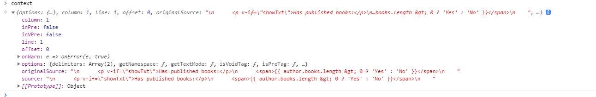
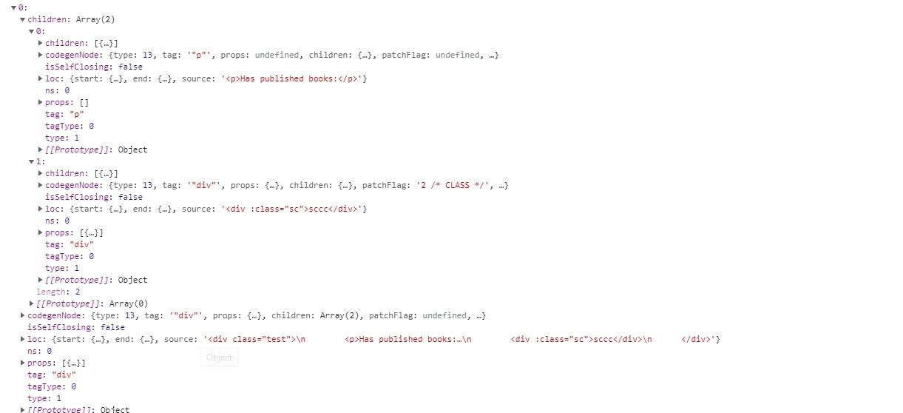
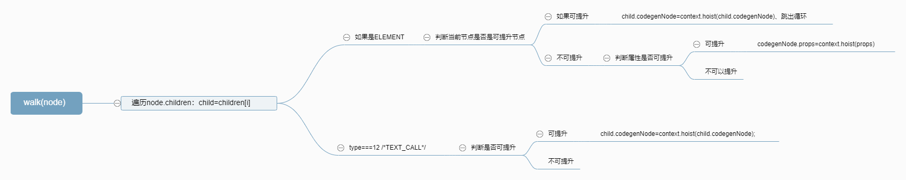
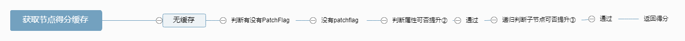
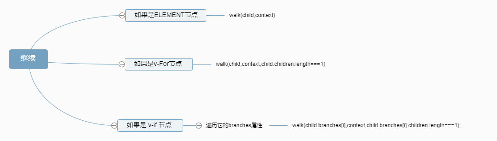

vue3编译源码看了一小部分、没看完。欢迎大佬们帮我补充没看的部分和指正错误。

[super-tiny-compile 翻译过后的代码地址](https://github.com/starkwang/the-super-tiny-compiler-cn/blob/master/super-tiny-compiler-chinese.js)

省流助手：可以只看上面的git地址就行了

总体步骤

	1、解析。 原始代码 > ast （1.while 2.递归）
	2、转换。（优化ast → newast）
	3、代码生成。（Generation）
	4、ps:类似的目标代码应该可以使用同一套newast、或者vdom。
	
(add 2 (subtract 4 2)) → add(2, subtract(4, 2))

1.词法分析通常是逐个遍历解析源代码的每一个字符串。这里vue也是比较传统的。

用current作为指针、用while逐字分析、每分析一个字就将指针向后移动一位。 分析的时候、用正则表达式判断是数字还是字符串还是括号、将他们赋予不同的type用一个对象保存、组成数组

2.这是一个方法内套着一个方法、要把它的关键点抽象出来就要抽象成树的形式（ast）。然后才方便将这个树翻译成另一种语言
源代码的特点是 '(' 后面跟着方法名、方法名后面是这个方法的参数、应该把参数变成这个方法的子节点

'(' 后面跟着方法名： 

```
	// 接下来我们检查是不是 CallExpressions 类型，我们从左圆括号开始。
    if (
      token.type === 'paren' &&
      token.value === '('
      ) {
        
      // zwk :::  vue里 找到< 之后，就找后面的代码，  可能是标签开头 、可能是/ 标签结尾（除了注释之类）
      
      // 我们会自增 `current` 来跳过这个括号，因为括号在 AST 中是不重要的。 zwk ::: 圆括号代表的意思很重要，但是圆括号不需要再ast中显示
      token = tokens[++current];

      // 我们创建一个类型为 `CallExpression` 的根节点，然后把它的 name 属性设置为当前
      // token 的值，因为紧跟在左圆括号后面的 token 一定是调用的函数的名字。 
      var node = {
        type: 'CallExpression',
        name: token.value,
        params: [] // 子节点就放这
      };

      // 我们再次自增 `current` 变量，跳过当前的 token 
      token = tokens[++current];
```

后面自然跟着方法参数、
```
	  while (
        (token.type !== 'paren') ||
        (token.type === 'paren' && token.value !== ')')
      ) {
        // 我们调用 `walk` 函数，它将会返回一个结点，然后我们把这个节点
        // 放入 `node.params` 中。
        node.params.push(walk()); // zwk ::: 递归了
        token = tokens[current];
      }
```

3.优化ast、让其转换成目标语言更方便。=
给每个type设置了不同的转换函数，并通过visitor传过来。

```
    var method = visitor[node.type]; // zwk ::： 关键就是每一种 type 对应一种处理方法  vue的更复杂，因为vue还要处理 标签的 attr 等

    // 如果有，那么我们把 `node` 和 `parent` 都传入其中。
    if (method) {
      method(node, parent); // zwk ::: 这里才是真正处理的ast的地方
    }
```
node代表ast树上的某一项。

```
    switch (node.type) { // zwk ::: 单纯的递归

      // 我们从顶层的 `Program` 开始，Program 结点中有一个 body 属性，它是一个由若干
      // 个结点组成的数组，所以我们对这个数组调用 `traverseArray`。
      //
      // （记住 `traverseArray` 会调用 `traverseNode`，所以我们会递归地遍历这棵树。）
      case 'Program':
        traverseArray(node.body, node);
        break;

      // 下面我们对 `CallExpressions` 做同样的事情，遍历它的 `params`。
      case 'CallExpression':
        traverseArray(node.params, node);
        break;

      // 如果是 `NumberLiterals`，那么就没有任何子结点了，所以我们直接 break
      case 'NumberLiteral':
        break;

      // 同样，如果我们不能识别当前的结点，那么就抛出一个错误。
      default:
        throw new TypeError(node.type);
    }
  }
```
递归。

4.codeGenerator

Vue部分 <br/>
[vue-next-template-explorer](https://vue-next-template-explorer.netlify.app/)

一：直接就从 baseParse 开始、因为vue比较牛、词法分析和语法分析是一起解决的。<br/>
代码可以从 function parseChildren 开始看。一看这函数名就是一个递归。



函数传进了这个参数、column、line、offset是指针。source是将被解析的代码。

通过while和指针、一步一步往后解析。

删除一些解析注释和解析错误代码的代码。

```
while (!isEnd(context, mode, ancestors)) {
      const s = context.source; // 将被遍历和修改的template
      let node = undefined;
      if (mode === 0 /* DATA */ || mode === 1 /* RCDATA */) {
        if (!context.inVPre && startsWith(s, context.options.delimiters[0])) {
          // 解析'{{}}'
          node = parseInterpolation(context, mode);
        }
        else if (mode === 0 /* DATA */ && s[0] === '<') {
          // 结束标签
          else if (s[1] === '/') {
            if (/[a-z]/i.test(s[2])) {
              emitError(context, 23 /* X_INVALID_END_TAG */);
              parseTag(context, 1 /* End */, parent);
              continue;
            }
            else {
              emitError(context, 12 /* INVALID_FIRST_CHARACTER_OF_TAG_NAME */, 2);
              node = parseBogusComment(context);
            }
          }
          // 开始标签
          else if (/[a-z]/i.test(s[1])) {
            node = parseElement(context, ancestors);
          }
        }
      }
      // 解析字符串
      if (!node) {
        node = parseText(context, mode);
      }
//////////////下面的先不管//////////////////
      if (isArray(node)) {
        for (let i = 0; i < node.length; i++) {
          pushNode(nodes, node[i]);
        }
      }
      else {
        pushNode(nodes, node);
      }
    }
```

总共就三种解析：1.开头是<的就解析标签 parseElement 2.开头{{ 的就解析模板 parseInterpolation  3.其余就是parseText. 

所有的解析大概有三个工作内容，1.找到这次解析的结尾。 2.当前指针作为开头， 解析开头到结尾的部分 3.将指针移动到结尾 4.将解析过的代码从source中移除

1.parseText
通过 indexOf 找到下一个 '<' 或者 ‘{{’、确定字符串结尾位置、截取这段字符串放入 content,

解析出来的 content全是空格  \n 之类的话将被丢弃

2.parseElement

parseTag：通过正则表达式解析出tag、更新指针位置、将'<tag'部分从source中剪切掉

parseAttributes： 没看，但是必要的工作内容是不会少的。 剪切、移动指针之类

isSelfClosing = startsWith(context.source, '/>');：看看是不是自闭标签

是的话将 /> 剪切掉并移动指针、 return

不是的话同样的处理 > 

parseChildren进入递归

```
function parseElement(context, ancestors) {
    // Start tag.
    const wasInPre = context.inPre;
    const wasInVPre = context.inVPre;
    const parent = last(ancestors);
    const element = parseTag(context, 0 /* Start */, parent);
    const isPreBoundary = context.inPre && !wasInPre;
    const isVPreBoundary = context.inVPre && !wasInVPre;
    if (element.isSelfClosing || context.options.isVoidTag(element.tag)) {
      // #4030 self-closing <pre> tag
      if (context.options.isPreTag(element.tag)) {
        context.inPre = false;
      }
      return element;
    }
    // Children.
    ancestors.push(element);
    const mode = context.options.getTextMode(element, parent);
    // 递归
    const children = parseChildren(context, mode, ancestors); // 进入递归了。也只有这一种需要进入递归
    ancestors.pop();
    element.children = children;
```

```
	if (startsWithEndTagOpen(context.source, element.tag)) {
      parseTag(context, 1 /* End */, parent);
    }
```

寻找并解析自己的结束标签

3.parseInterpolation

通过 "}}" 获取结束位置、其余和parseText差不多。


二：ast转换、这里我只看了一小部分。

getBaseTransformPreset函数收集了一堆用于转换的方法。放进 nodeTransforms 中。

```

    function getBaseTransformPreset(prefixIdentifiers) {
      return [
        [
          transformOnce,
          transformIf,
          transformFor,
          ...([]),
          ...([transformExpression]
          ),
          transformSlotOutlet,
          transformElement,
          trackSlotScopes,
          transformText
        ],
        {
          on: transformOn,
          bind: transformBind,
          model: transformModel
        }
      ];
    }
```

很多看名字就能知道是用来转换什么的

```
	const [nodeTransforms, directiveTransforms] = getBaseTransformPreset();
    transform(ast, extend({}, options, {
      prefixIdentifiers,
      nodeTransforms: [
        ...nodeTransforms,
        ...(options.nodeTransforms || []) // user transforms
      ],
      directiveTransforms: extend({}, directiveTransforms, options.directiveTransforms || {} // user transforms
      )
    }));
```

traverseNode:
```
function traverseNode(node, context) {
    context.currentNode = node;
    // apply transform plugins
    const { nodeTransforms } = context;
    const exitFns = []; // 用于收集转换之后返回的函数、这个函数要经过执行才能完成最终转换。应该是。
    for (let i = 0; i < nodeTransforms.length; i++) { 
      const onExit = nodeTransforms[i](node, context); // 用每个 nodeTransforms[i] 去处理 node 
      if (onExit) {
        if (isArray(onExit)) {
          exitFns.push(...onExit);
        }
        else {
          exitFns.push(onExit);
        }
      }
      if (!context.currentNode) {
        // node was removed
        return;
      }
      else {
        // node may have been replaced
        node = context.currentNode;
      }
    }
	switch (node.type) {
      case 3 /* COMMENT */:
        if (!context.ssr) {
          // inject import for the Comment symbol, which is needed for creating
          // comment nodes with `createVNode`
          context.helper(CREATE_COMMENT);
        }
        break;
      case 5 /* INTERPOLATION */:
        // no need to traverse, but we need to inject toString helper
        if (!context.ssr) {
          context.helper(TO_DISPLAY_STRING);
        }
        break;
      // for container types, further traverse downwards
      case 9 /* IF */:
        for (let i = 0; i < node.branches.length; i++) {
          traverseNode(node.branches[i], context); // 递归
        }
        break;
      case 10 /* IF_BRANCH */:
      case 11 /* FOR */:
      case 1 /* ELEMENT */:
      case 0 /* ROOT */:
        traverseChildren(node, context); // 递归
        break;
    }
    // exit transforms
    context.currentNode = node;
    let i = exitFns.length;
    while (i--) {
      exitFns[i]();
    }
  }
```
递归部分不重要，重要的是处理函数。

处理函数大部分会验证这个node是否需要我处理。

例如：
```
  // 第一个参数用于判断是否需要处理。第二个参数 回调函数是真正做处理的地方
  const transformIf = createStructuralDirectiveTransform(/^(if|else|else-if)$/, (node, dir, context) => {...........}}
  
  function createStructuralDirectiveTransform(name, fn) { //  /^(if|else|else-if)$/
    const matches = isString(name)
      ? (n) => n === name
      : (n) => name.test(n);
    return (node, context) => {
      if (node.type === 1 /* ELEMENT */) {
        const { props } = node;
        // structural directive transforms are not concerned with slots
        // as they are handled separately in vSlot.ts
        if (node.tagType === 3 /* TEMPLATE */ && props.some(isVSlot)) {
          return;
        }
        const exitFns = [];
        for (let i = 0; i < props.length; i++) {
          const prop = props[i];
          // 判断prop.name（例如：v-if的prop.name是if）是否匹配正则表达式name，匹配就能执行name匹配的fn，并且这个prop将被解析，所以在props数组中删除这一项
          if (prop.type === 7 /* DIRECTIVE */ && matches(prop.name)) { // ............在这里做判断
            // structural directives are removed to avoid infinite recursion
            // also we remove them *before* applying so that it can further
            // traverse itself in case it moves the node around
            props.splice(i, 1);
            i--;
            const onExit = fn(node, prop, context); // ...............判断通过之后处理
            if (onExit)
              exitFns.push(onExit); // 处理过后获得的是一个方法。 传到外面去
          }
        }
        return exitFns;
      }
    };
  }

  // ...............fn(node, prop, context)所调用的处理方法在这。 这个方法调用了processIf
  const transformIf = createStructuralDirectiveTransform(/^(if|else|else-if)$/, (node, dir, context) => { 
    return processIf(node, dir, context, (ifNode, branch, isRoot) => { // ...............processIf加工node之后执行这里。
      // #1587: We need to dynamically increment the key based on the current
      // node's sibling nodes, since chained v-if/else branches are
      // rendered at the same depth
      const siblings = context.parent.children;
      let i = siblings.indexOf(ifNode);
      let key = 0;
      while (i-- >= 0) {
        const sibling = siblings[i];
        if (sibling && sibling.type === 9 /* IF */) {
          key += sibling.branches.length;
        }
      }
      // Exit callback. Complete the codegenNode when all children have been
      // transformed.
      return () => { // ...............最终返回这个函数
        if (isRoot) {
          ifNode.codegenNode = createCodegenNodeForBranch(branch, key, context);
        }
        else {
          // attach this branch's codegen node to the v-if root.
          const parentCondition = getParentCondition(ifNode.codegenNode);
          parentCondition.alternate = createCodegenNodeForBranch(branch, key + ifNode.branches.length - 1, context);
        }
      };
    });
  });
  // ...............processIf对 node进行加工之后 执行 processCodegen， 又回去了， 
  function processIf(node, dir, context, processCodegen) {
    if (dir.name !== 'else' &&
      (!dir.exp || !dir.exp.content.trim())) {
      const loc = dir.exp ? dir.exp.loc : node.loc;
      context.onError(createCompilerError(27 /* X_V_IF_NO_EXPRESSION */, dir.loc));
      dir.exp = createSimpleExpression(`true`, false, loc);
    }
    if (dir.exp) {
      validateBrowserExpression(dir.exp, context);
    }
    if (dir.name === 'if') {
      const branch = createIfBranch(node, dir);
      const ifNode = {
        type: 9 /* IF */,
        loc: node.loc,
        branches: [branch]
      };
      context.replaceNode(ifNode);
      if (processCodegen) {
        return processCodegen(ifNode, branch, true);
      }
    }
............
}
```

exitFns[]()执行的时候 v-if部分
```
	  () => {
        if (isRoot) {
          ifNode.codegenNode = createCodegenNodeForBranch(branch, key, context);
        }
        else {
          // attach this branch's codegen node to the v-if root.
          const parentCondition = getParentCondition(ifNode.codegenNode);
          parentCondition.alternate = createCodegenNodeForBranch(branch, key + ifNode.branches.length - 1, context);
        }
      }
  function createCodegenNodeForBranch(branch, keyIndex, context) {
    if (branch.condition) {
      return createConditionalExpression(branch.condition, createChildrenCodegenNode(branch, keyIndex, context),
        // make sure to pass in asBlock: true so that the comment node call
        // closes the current block.
        createCallExpression(context.helper(CREATE_COMMENT), [
          '"v-if"',
          'true'
        ]));
    }
    else {
      return createChildrenCodegenNode(branch, keyIndex, context);
    }
  }
```
对照vue-template看这里

接下来没了，到这里就有点难看懂了。


节点提升：



先看

switch (node.type) { // 通过type的不同执行不同的方法
case 1 /* ELEMENT */: 

（很多type不清楚全部用途。所以不细讲）


判断当前节点是否是可提升节点，用下面的方法：

获取各个节点对于是否可以提升的得分（应该还有其他用处、不清楚），分数 >= 2就可以提升

```
function getConstantType(node, context) {
    const { constantCache } = context;
    switch (node.type) {
      case 1 /* ELEMENT */:
        if (node.tagType !== 0 /* ELEMENT */) {
          return 0 /* NOT_CONSTANT */;
        }
        const cached = constantCache.get(node); // :::zwk 注意这里有个缓存。 使用 map()
        if (cached !== undefined) {
          return cached;
        }
        const codegenNode = node.codegenNode;
        if (codegenNode.type !== 13 /* VNODE_CALL */) {
          return 0 /* NOT_CONSTANT */;
        }
        // :::zwk 获取 patchFlag 属性
        // 见13617行
        const flag = getPatchFlag(codegenNode); 
        if (!flag) {
          // :::zwk 默认3， 可提升
          let returnType = 3 /* CAN_STRINGIFY */;
          // Element itself has no patch flag. However we still need to check:
          // 1. Even for a node with no patch flag, it is possible for it to contain
          // non-hoistable expressions that refers to scope variables, e.g. compiler
          // injected keys or cached event handlers. Therefore we need to always
          // check the codegenNode's props to be sure.
          // ::: zwk 判断属性是否是静态
          const generatedPropsType = getGeneratedPropsConstantType(node, context);
          if (generatedPropsType === 0 /* NOT_CONSTANT */) {
            constantCache.set(node, 0 /* NOT_CONSTANT */);
            return 0 /* NOT_CONSTANT */;
          }
          // :::zwk 数字越高越说明可提升，哪一项得分低了，就要代替原有得分
          if (generatedPropsType < returnType) {
            returnType = generatedPropsType;
          }
          // 2. its children.
          // :::zwk 递归的判断子节点是不是静态的
          for (let i = 0; i < node.children.length; i++) {
            const childType = getConstantType(node.children[i], context);
            if (childType === 0 /* NOT_CONSTANT */) {
              constantCache.set(node, 0 /* NOT_CONSTANT */);
              return 0 /* NOT_CONSTANT */;
            }
            // :::zwk 数字越高越说明可提升，子节点如果得分低，父节点也是那个分， 因为子节点如果不是静态的不能提升。父节点就也不能提升
            if (childType < returnType) {
              returnType = childType;
            }
          }
          // 3. if the type is not already CAN_SKIP_PATCH which is the lowest non-0
          // type, check if any of the props can cause the type to be lowered
          // we can skip can_patch because it's guaranteed by the absence of a
          // patchFlag.
          // :::zwk 判断 属性 是不是静态的
          if (returnType > 1 /* CAN_SKIP_PATCH */) {
            for (let i = 0; i < node.props.length; i++) {
              const p = node.props[i];
              if (p.type === 7 /* DIRECTIVE */ && p.name === 'bind' && p.exp) {
                // ::: zwk TODO
                const expType = getConstantType(p.exp, context);
                if (expType === 0 /* NOT_CONSTANT */) {
                  constantCache.set(node, 0 /* NOT_CONSTANT */);
                  return 0 /* NOT_CONSTANT */;
                }
                if (expType < returnType) {
                  returnType = expType;
                }
              }
            }
          }
          // only svg/foreignObject could be block here, however if they are
          // static then they don't need to be blocks since there will be no
          // nested updates.
          if (codegenNode.isBlock) {
            context.removeHelper(OPEN_BLOCK);
            context.removeHelper(CREATE_BLOCK);
            codegenNode.isBlock = false;
            context.helper(CREATE_VNODE);
          }
          constantCache.set(node, returnType);
          return returnType;
        }
        else {
          constantCache.set(node, 0 /* NOT_CONSTANT */);
          return 0 /* NOT_CONSTANT */;
        }
      case 2 /* TEXT */:
      case 3 /* COMMENT */:
        return 3 /* CAN_STRINGIFY */;
      case 9 /* IF */:
      case 11 /* FOR */:
      case 10 /* IF_BRANCH */:
        return 0 /* NOT_CONSTANT */;
      case 5 /* INTERPOLATION */:
      case 12 /* TEXT_CALL */:
        return getConstantType(node.content, context);
      case 4 /* SIMPLE_EXPRESSION */:
        return node.constType;
      case 8 /* COMPOUND_EXPRESSION */:
        let returnType = 3 /* CAN_STRINGIFY */;
        for (let i = 0; i < node.children.length; i++) {
          const child = node.children[i];
          if (isString(child) || isSymbol(child)) {
            continue;
          }
          const childType = getConstantType(child, context);
          if (childType === 0 /* NOT_CONSTANT */) {
            return 0 /* NOT_CONSTANT */;
          }
          else if (childType < returnType) {
            returnType = childType;
          }
        }
        return returnType;
      default:
        return 0 /* NOT_CONSTANT */;
    }
  }
```

node.type === 1大体过程： 


节点（node）能提升的条件： 属性可提升，子节点可提升。 所以先判断属性是否可提升，再递归的判断子节点是否可提升。

因为需要判断子节点可否提升（所以是个递归的过程）

总体过程是个扣分的过程、初始分数3、得分2就代表可以提升，标记②和③的过程都会返回相应得分。低分数将代替现有分数（因为父节点可否提升依靠它的属性和子节点）

中途得分0直接return、return的时候就是确定了最终得分、所以在return之前、节点的得分将被缓存

所以递归子节点的时候、子节点的得分都被缓存了。


如果节点不是可提升节点


所以接下来是递归的判断子节点是否可提升。

①：在判断父节点可不可以提升的时候就可能判断了子节点是不是可以提升、判断的结果会被缓存、所以这时候缓存就有用了

静态属性 type: 4 

if: type: 9

for: type: 11

```
/**
       * :::zwk ---------------------------zwk--------------
       * type = 2: 纯字符串
       * type = 5: {{}} 模板
       * type = 1 :  ELEMENT,元素
       * type = 1时 ： tagType = 0 正常
       *               = 2 slot元素
       *               = 1 组件
       *               = 3 template
       */


```
