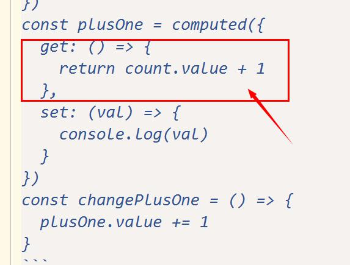

### computed源码：
```
class ComputedRefImpl {
  constructor(getter, _setter, isReadonly) {
    this._setter = _setter;
    this._dirty = true;
    this.__v_isRef = true;
    this.effect = effect(getter, {
      lazy: true,
      scheduler: () => {
        if (!this._dirty) {
          this._dirty = true;
          trigger(toRaw(this), "set" /* SET */, 'value');
        }
      }
    });
    this["__v_isReadonly" /* IS_READONLY */] = isReadonly;
  }
  get value() {
    // the computed ref may get wrapped by other proxies e.g. readonly() #3376
    const self = toRaw(this);
    if (self._dirty) {
      self._value = this.effect();
      self._dirty = false;
    }
    track(self, "get" /* GET */, 'value');
    return self._value;
  }
  set value(newValue) {
    this._setter(newValue);
  }
}
```

### effect源码
```
function effect(fn, options = EMPTY_OBJ) {
  if (isEffect(fn)) {
    fn = fn.raw;
  }
  const effect = createReactiveEffect(fn, options);
  if (!options.lazy) {
    effect();
  }
  return effect;
}

function createReactiveEffect(fn, options) {
  const effect = function reactiveEffect() {
    if (!effect.active) {
      return fn();
    }
    if (!effectStack.includes(effect)) {
      cleanup(effect);
      try {
        enableTracking();
        effectStack.push(effect);
        activeEffect = effect;
        return fn();
      }
      finally {
        effectStack.pop();
        resetTracking();
        activeEffect = effectStack[effectStack.length - 1];
      }
    }
  };
  effect.id = uid++;
  effect.allowRecurse = !!options.allowRecurse;
  effect._isEffect = true;
  effect.active = true;
  effect.raw = fn;
  effect.deps = [];
  effect.options = options;
  return effect;
}
```

### 自己的js
```
const count = reactive({
  value: 0
})
const plusOne = computed({
  get: () => {
    return count.value + 1
  },
  set: (val) => {
    console.log(val)
  }
})
const changePlusOne = () => {
  plusOne.value += 1
}
```
然后plusOne在html中使用。


这里值与render的绑定经历了两层，首先是rendAer执行，render方法进入effectStack(effect栈)，触发plusOne的get，执行this.effect。

这个effect的fn参数是<br />

但是this.effect有scheduler方法（所以this.effect被触发时执行的是scheduler里面的方法），此时this.effect进入了effectStack，
activeEffect变成了this.effect。this.effect里面的方法执行，count的get方法执行，将count和this.effect绑定。<br />
this.effect执行完成,this.effect退出effectStack，render形成的effect变成新的activeEffect。<br />
 <br />
然后track(self, "get" /* GET */, 'value');执行，将render和computed的值plusOne绑定。 <br />
所以count改变时，触发this.effect的执行，触发trigger(toRaw(this), "set" /* SET */, 'value');（this是computed的this。即plusOne），
所以plusOne所绑定的effect会被执行，即render函数执行。


computed的effect和数据的绑定比较复杂，总之是computed的get方法里面的count会和需要plusOne的函数(render)绑定，
也就是说count变化时，会经过一系列map，寻找到render函数， 让render函数执行。
而要让他们两个绑定的前提，就是有需要用到plusOne的函数，因为只有这样才会触发plusOne的get方法，执行这个绑定。

所以每次count变化时，都会让需要plusOne的函数执行（render）。但是plusOne自己的set是自定义的，不会引起需要plusOne的方法(render)的执行
所以直接改变plusOne不会引起需要plusOne的函数（render）执行（所以不引起html的变化）


所以除非你让computed的set方法的执行改变count。才能达到改变plusOne和改变html的目的

