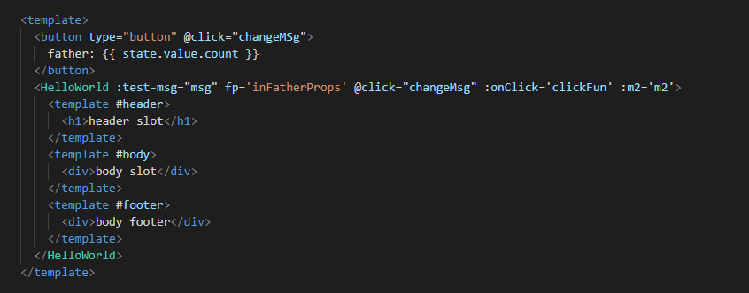
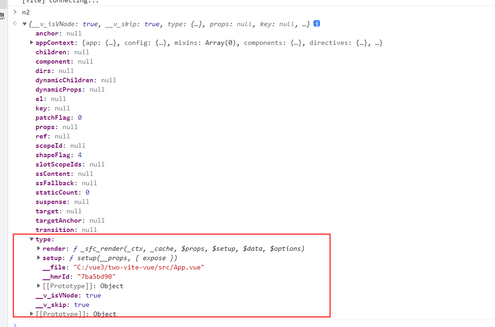
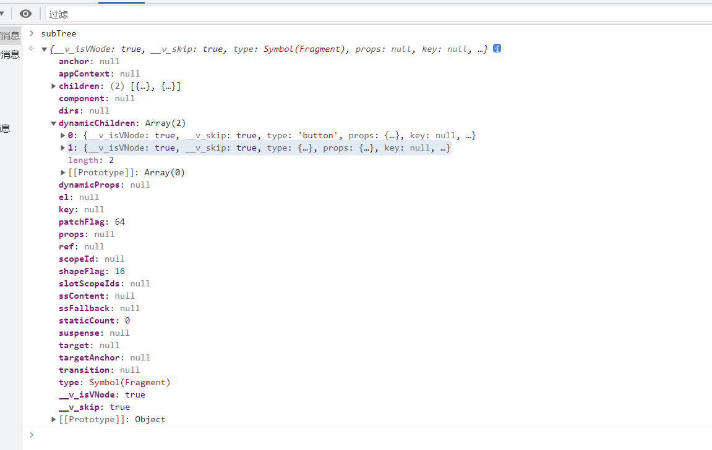
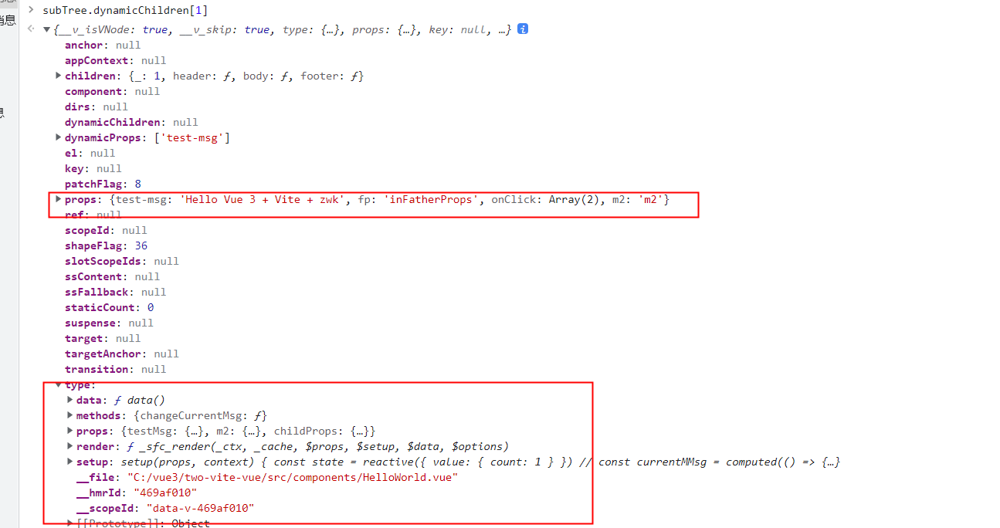
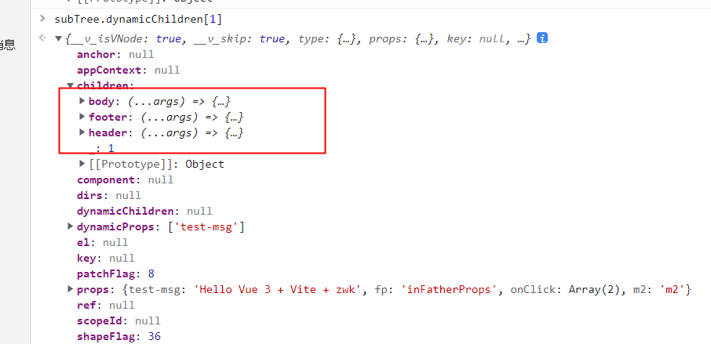
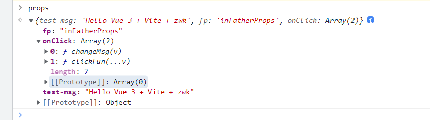

如果要看这部分源码。先要了解vue3的响应式原理里面的effect。

（mountComponent：patch过程中的组件挂载）


Vue组件化相关的逻辑主要在patch过程中。

Vue将模板编译成VNode之后，需要patch它。patch是个深度遍历过程，patch的时候用VNode的type属性判断它属于什么节点。Vue用vnode.type来储存组件的选项对象。所以当type是对象时，就需要对这个节点进行组件解析。省略中间过程。就是要执行组件的render方法获取子节点。然后再对子节点patch。

app,vue


最开始组件的vnode：

这是app.vue编译形成的vnode。type内储存着组件选项。

render执行之后生成了它的子节点

看subTree.dynamicChildren[1]

这里type是保存什么的就很清楚。并且在subTree.dynamicChildren[1].props内也保存了HelloWorld的属性。

插槽保存在children里


**组件的更新。

组件的补丁更新的实现主要由于组件的各个属性保存在instance内，instance由于闭包保存在缓存里，组件更新触发effect的方法时就可以获取旧的vnode：instance.subTree， 和生成新的vnode： render.call(state)，两者进行对比实现补丁更新。**

上述需要在组件第一次挂载（mountComponent）时实现

伪代码：（从《Vue.js设计与实现》 书上抄下来）

```
function mountComponent() {
	const componentOptions = vnode.type // vnode的type保存组件选项。
	const { render， data } = componentOptions
	const state = reactive(data())
	const instance = {
		isMounted: false,
		subTree: null
	}
	//  因为更新时是对比vnode。所以要在vnode上保存instance
	vnode.comoponent = instance
	
	effect(() => {
		const subTree = render.call(state)
		if(!instance.isMounted) {
			patch(null, subTree)
			instance.isMounted = true
		} else {
			// 实现补丁更新。
			patch(instance.subTree, subTree)
		}
		instance.subTree = subTree
	})
}
```

通过看书让我们理解Vue的思路，然后具体的代码可以去源码上看


1.initProps

initProps这个步骤是在mountComponent中用于解析组件的props。

接下来提到的组件实例，指的是一个用于储存组件各种东西的对象：写作instance。

App.vue
```
<HelloWorld :test-msg="msg" fp='inFatherProps'/>

const msg = ref('Hello Vue 3 + Vite + zwk')
```

HelloWorld.vue
```
const props = defineProps({
  testMsg: String,
  childProps: String
})
```

父组件传的值有 test-msg 和 fp

子组件props选项内有 testMsg 和 childProps。
```
// rawProps 是父组件传给子组件的props，
// instance.propsOptions来自组件内的props选项。
function initProps(instance, rawProps, isStateful, // result of bitwise flag comparison
isSSR = false) {
    const props = {};
    const attrs = {};
    def(attrs, InternalObjectKey, 1);
    instance.propsDefaults = Object.create(null);
    setFullProps(instance, rawProps, props, attrs); // rawProps的key和value传给props，并将rawProps里xxx-xx表示的key转成驼峰的写法（test-msg -> testMsg）
	// attrs：{fp: 'inFatherProps', __vInternal: 1}
	// props：{testMsg: 'Hello Vue 3 + Vite + zwk'}
    // ensure all declared prop keys are present
    for (const key in instance.propsOptions[0]) {
        if (!(key in props)) {
            props[key] = undefined; // 如果组件自身的props选项内的某个值父组件没传，把它添加到props内并赋值 undefined
			// 这里props的结果：{testMsg: 'Hello Vue 3 + Vite + zwk', childProps: undefined}
        }
    }
    // validation
    if ((process.env.NODE_ENV !== 'production')) {
        validateProps(rawProps || {}, props, instance);
    }
    if (isStateful) {
        // stateful
        instance.props = isSSR ? props : shallowReactive(props);
    }
    else {
        if (!instance.type.props) {
            // functional w/ optional props, props === attrs
            instance.props = attrs;
        }
        else {
            // functional w/ declared props
            instance.props = props;
        }
    }
    instance.attrs = attrs;
}
```

**setFullProps方法，将区分从父组件传来的值是props还是attrs，如果为组件传递的props数据在组件自身的props选项中有定义，这将其视为合法的props（保存在props中）**

**否则将其保存在attrs中。**


**test-msg解析时会被解析成 testMsg**

fp会被当做 attrs。

没有传值的childProps也会放入props中并赋值undefined。

**然后这个props将会作为第一个参数传入setup函数中。**

伪代码：

const setupResult = setup(props, setupContext) // setupContext内包含

**所以这里得到的props必须是在组件自身的props选项中声明。**

**（所以为什么要在mountComponent中initProps，因为props需要传入setup函数，并且之后还可能在render()方法中用到，或者在旧的选项式api中使用。）**

然后看看vue对 setupResult  的处理

mini-vue去除不重要的代码保存了我们需要学习的代码如下：

```
function handleSetupResult(instance, setupResult) {
  // setup 返回值不一样的话，会有不同的处理
  // 1. 看看 setupResult 是个什么
  if (typeof setupResult === "function") {
    // 如果返回的是 function 的话，那么绑定到 render 上
    // 认为是 render 逻辑
    // setup(){ return ()=>(h("div")) }
    instance.render = setupResult;
  } else if (typeof setupResult === "object") {
    // 返回的是一个对象的话
    // 先存到 setupState 上
    // 先使用 @vue/reactivity 里面的 proxyRefs
    // 后面我们自己构建
    // proxyRefs 的作用就是把 setupResult 对象做一层代理
    // 方便用户直接访问 ref 类型的值
    // 比如 setupResult 里面有个 count 是个 ref 类型的对象，用户使用的时候就可以直接使用 count 了，而不需要在 count.value
    // 这里也就是官网里面说到的自动结构 Ref 类型
    instance.setupState = proxyRefs(setupResult);
  }

  finishComponentSetup(instance);
}

// reactivity模块
function unref(ref) {
    return isRef(ref) ? ref.value : ref;
}
const shallowUnwrapHandlers = {
    get: (target, key, receiver) => unref(Reflect.get(target, key, receiver)),
    set: (target, key, value, receiver) => {
        const oldValue = target[key];
        if (isRef(oldValue) && !isRef(value)) {
            oldValue.value = value;
            return true;
        }
        else {
            return Reflect.set(target, key, value, receiver);
        }
    }
};
function proxyRefs(objectWithRefs) {
    return isReactive(objectWithRefs)
        ? objectWithRefs
        : new Proxy(objectWithRefs, shallowUnwrapHandlers);
}
```

setup方法的返回值：setupResult,如果setupResult是函数。会将其视为渲染函数传给render。

如果setupResult非null且是对象


注释上说了， proxyRefs(setupResult)生成了一个代理：instance.setupState，自动结构 Ref 类型。（挖坑----------TODO--------：验证自动结构的作用）

我们要清楚setupResult将用在哪里。它将作为this在其他组件选项中被调用（这只是this中的其中一项），例如：created.call(setupResult )。或者用在template中。

例如：

```
setup(props, context) {
    const state = reactive({
      value: {
        count: 1
      }
    })
    // const currentMMsg = computed(() => props.testMsg)
    const currentMMsg = ref('')
    watchEffect(() => {
      currentMMsg.value = props.testMsg
    })
    // function changeCurrentMsg() {
    //   currentMMsg.value+= '1'
    // }
    const newMsg = reactive({ value: 'hello world' })
    return {
      newMsg,
      // changeCurrentMsg,
      currentMMsg,
      state
    }
  },
  methods: {
    changeCurrentMsg() {
      this.currentMMsg+= '1'
    }
  }
```

**this的其中一项是setup函数的返回值，这里this.currentMMsg的值是setupResult中的currentMMsg，并且currentMMsg后面不需要.value。但是vue3更加提倡使用组合api。不建议混用vue2的传统组件选项**

**2.emit**

在setup运行之前。我们需要生成一个emit方法合并入setup的第二个参数。

大体实现方式：根据事件名去props数据对象中寻找对应的处理函数去执行

app.vue

```
<HelloWorld :test-msg="msg" fp='inFatherProps' @click="changeMsg"/>

```

HelloWorld.vue

```
	function changeCurrentMsg() {
      currentMMsg.value+= '1'
      context.emit('click', currentMMsg.value)
    }
```

去除了一些不用在意的源码
```
// click => onClick
const toHandlerKey = cacheStringFunction((str) => (str ? `on${capitalize(str)}` : ``));

function emit(instance, event, ...rawArgs) {
	// ------------------ event: click
    const props = instance.vnode.props || EMPTY_OBJ; //  ------------------ props: {test-msg: 'Hello Vue 3 + Vite + zwk', fp: 'inFatherProps', onClick: ƒ}
    let args = rawArgs;
    const isModelListener = event.startsWith('update:');
    // for v-model update:xxx events, apply modifiers on args
    const modelArg = isModelListener && event.slice(7);
    if (modelArg && modelArg in props) {
        const modifiersKey = `${modelArg === 'modelValue' ? 'model' : modelArg}Modifiers`;
        const { number, trim } = props[modifiersKey] || EMPTY_OBJ;
        if (trim) {
            args = rawArgs.map(a => a.trim());
        }
        else if (number) {
            args = rawArgs.map(toNumber);
        }
    }
    let handlerName;
	// ------------------ handlerName  = toHandlerKey('click'))  handlerName： onClick， 去 props中匹配
    let handler = props[(handlerName = toHandlerKey(event))] ||
        // also try camelCase event handler (#2249)
        props[(handlerName = toHandlerKey(camelize(event)))];
    // for v-model update:xxx events, also trigger kebab-case equivalent
    // for props passed via kebab-case
    if (!handler && isModelListener) {
        handler = props[(handlerName = toHandlerKey(hyphenate(event)))];
    }
    if (handler) {
        callWithAsyncErrorHandling(handler, instance, 6 /* COMPONENT_EVENT_HANDLER */, args);
    }
    const onceHandler = props[handlerName + `Once`];
    if (onceHandler) {
        if (!instance.emitted) {
            instance.emitted = {};
        }
        else if (instance.emitted[handlerName]) {
            return;
        }
        instance.emitted[handlerName] = true;
        callWithAsyncErrorHandling(onceHandler, instance, 6 /* COMPONENT_EVENT_HANDLER */, args);
    }
}

instance.emit = emit.bind(null, instance);

function createSetupContext(instance) {
    const expose = exposed => {
        instance.exposed = exposed || {};
    };
    else {
        return {
            attrs: instance.attrs,
            slots: instance.slots,
            emit: instance.emit,
            expose
        };
    }
}
```

emit的事件是去父组件传的props里面找。@click被解析成了onClick，子组件的emit的第一个参数是click。也被解析成了onClick

我觉得把@click解析成onClick是为了和普通的不加@的参数区分开。然后我想到，如果直接传一个参数，以on开头on后门的第一个字母是大写会怎么样

```
<HelloWorld :test-msg="msg" fp='inFatherProps' @click="changeMsg" :onClick='clickFun'/>

```

```
function clickFun(...v) {
  console.log(v)
}
function changeMsg(v) {
  msg.value = v
}
```

然后发现

onClick对应两个函数。两个都被执行了。

虽然也不知道这会不会有用、


3.slots

总之就是编译时父组件解析插槽内容并保存在instance.slots，子组件render执行时去访问响应的插槽内容。（这里我没打断点跑过）
