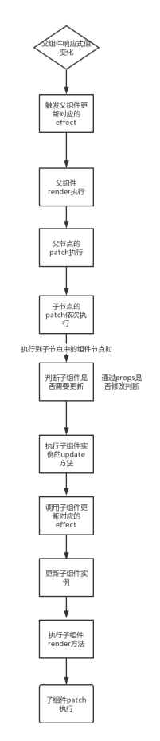

首先，  <HelloWorld :test-msg="msg" fp='inFatherProps'/>   msg变化时，如何让子组件更新。

以前我以为是子组件的props是响应式的值，msg变化触发子组件的testMsg变化，触发子组件更新。但这里有个漏洞（我猜的），如果fp变化。fp不在子组件的props选项内。子组件就不更新了吗。如果fp是style怎么办。

所以应该是HelloWorld 上所有属性变化。都触发子组件更新。这就是子组件的被动更新。


不过如果HelloWorld 组件的template下一级不止一个节点，<HelloWorld :test-msg="msg" :style='inFatherProps'/>,这个style也无法用于设置组件的样式。


下面这个流程图是看mini-vue画出来的



patch是patch 组件的vnode，vnode是棵树，patch时会深度遍历这棵树，当遍历到组件类型的节点时，会先根据props是否有变化判断是否需要更新这个组件。如果需要，就执行子组件实例的update方法，**这个方法会主动触发子组件对应的effect执行，更新子组件**

**从上面可以知道。子组件的props如果没有更新。子组件对应的effect不会执行。所以合理的分配组件能提高patch效率**

（这里effect指的是用于组件更新的函数，它作为effect和组件内的响应式对象绑定了。响应式对象变化时会触发这个effect，但是组件实例可以通过update方法主动触发effect执行）

**如果一个值是子组件用到的。但是它是由父组件传给子组件的。这个值更新会导致父组件和子组件都更新，都patch。可以考虑这个值只存在于子组件中，或者父组件把值传给子组件之后，值在子组件更新（但是还是要以开发效率为主）**

用vue源码验证过了。

App.vue
```
<button type="button" @click="changeMSg">
    changeMSg
  </button>
<HelloWorld :test-msg="msg" fp='inFatherProps'/>

const msg = ref('Hello Vue 3 + Vite + zwk')
function changeMSg() {
  msg.value += '1'
}
```

HelloWorld.vue
```
const props = defineProps({
  testMsg: String,
  childProps: String
})
const currentMMsg = ref('')
watchEffect(() => {
  currentMMsg.value = props.testMsg
})
function changeCurrentMsg() {
  currentMMsg.value+= '1'
}
```

App.vue的按钮changeMSg点击子组件父组件都会执行patch,

HelloWorld.vue的按钮changeCurrentMsg单电机只有子组件会执行patch。

所以可以考虑传值给子组件之后。

（但是这种情况，子组件的按钮点击之后，父组件的msg和子组件的currentMMsg是不相同的，所以父组件可能需要在点击时去获取下子组件内currentMMsg的值）